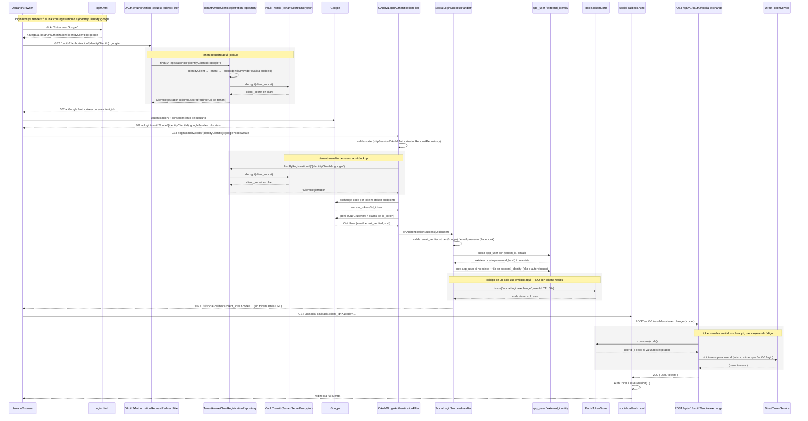
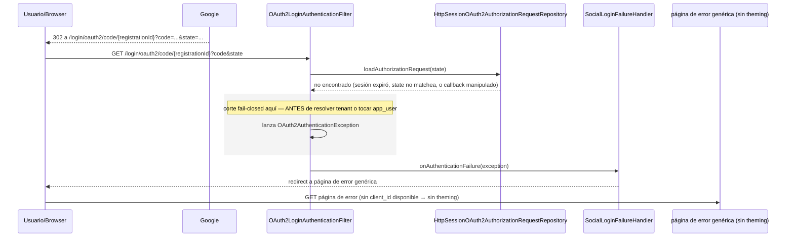
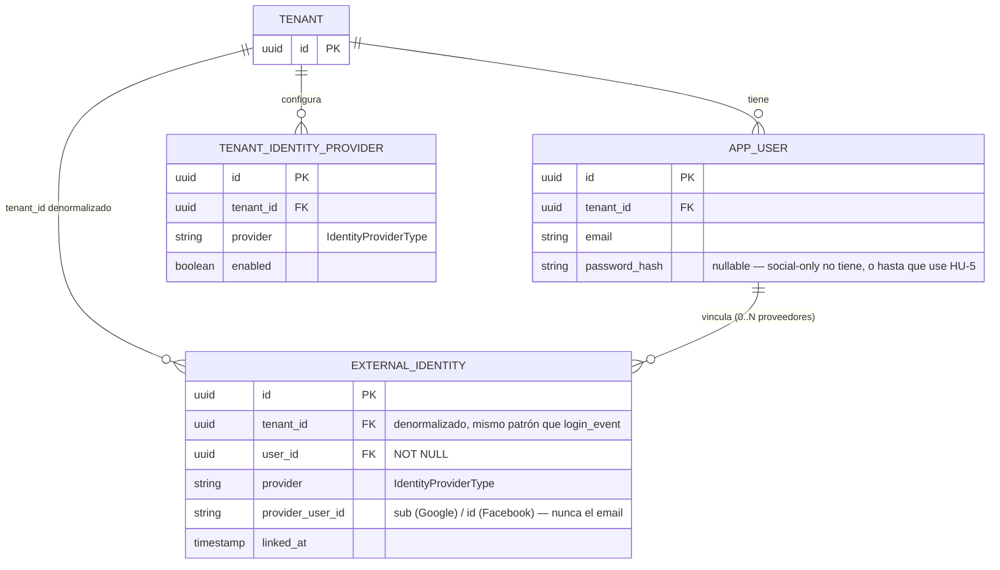

# Definición: Login social real end-to-end (Google/Facebook)

## Resumen ejecutivo
Hoy `auth-core-mc` solo tiene la mitad del login social construida: un admin de tenant puede guardar `client_id`/`client_secret` de Google/Facebook (tickets 006/017/029), pero no existe ningún botón, redirect ni callback funcional para un usuario final — `/ui/login` no tiene ninguna referencia a OAuth2 social. Este cambio construye el flujo real: botón en `/ui/login` y `/ui/register`, redirect al proveedor, callback que crea o vincula la cuenta, y sesión equivalente a un login con password — resolviendo el problema de diseño que motivó posponerlo desde el ticket 006: cómo un login **compartido entre todos los tenants** sabe contra cuál autenticar a quien vuelve del proveedor externo.

**Todas las preguntas abiertas de la primera versión de este documento ya fueron resueltas con VoBo del Product Owner (2026-08-21)** — ver "Decisiones resueltas" al final. El documento queda listo para desglosar en tickets.

## Objetivo de negocio
Permitir que un usuario final de cualquier tenant se autentique con su cuenta de Google o Facebook, sin depender exclusivamente de email/password, usando las credenciales que su tenant ya configuró vía `TenantIdentityProviderService`.

**Motivo de negocio (confirmado):** paridad competitiva — otros proveedores de identidad ya lo ofrecen.

### Usuarios y roles involucrados
| Rol | Qué hace en este cambio |
|---|---|
| **Usuario final** (de un tenant cualquiera) | Hace clic en "Iniciar sesión con Google/Facebook" desde `/ui/login` o `/ui/register`, se autentica en el proveedor, vuelve autenticado en `auth-core-mc`. |
| **Admin de tenant** (`TENANT_ADMIN`) | Ya configura `client_id`/`client_secret` (ticket 006/029) — sin cambio de rol, pero gana la responsabilidad de registrar el `redirect_uri` (único, compartido por todos los tenants — ver Decisiones resueltas) en su propia consola de Google/Facebook. |
| **Admin de plataforma** (`PLATFORM_ADMIN`) | Sin rol nuevo. |

No se identifican roles nuevos. **Apple queda fuera de alcance** — ya rechazado explícitamente desde el ticket 006 por falta de membresía de Apple Developer Program.

## Alcance

### Incluye
- Botones "Iniciar sesión con Google" y "Iniciar sesión con Facebook" en `/ui/login` **y `/ui/register`**, visibles solo si el tenant tiene ese proveedor `enabled`.
- Flujo completo: redirect al proveedor → callback → creación o vinculación de `app_user` → sesión/tokens equivalentes a un login con password.
- Registro implícito: un login social exitoso con un correo que no existe en el tenant crea la cuenta directamente.
- Vinculación automática cuando el correo coincide con un `app_user` existente **y el proveedor lo reporta como verificado**.
- Manejo explícito de fallo/cancelación del flujo.
- Tabla nueva `external_identity`, permitiendo que un usuario vincule **más de un proveedor social** a la vez.
- `login_event.provider` registrando `GOOGLE`/`FACEBOOK` reales (aditivo, sin migración).
- 2FA del tenant (si está habilitado/obligatorio) se sigue exigiendo después de un login social exitoso.
- **Un usuario social-only puede agregar una password después**, desde `/ui/cuenta`, para también poder usar `/api/v1/login` directo.

### No incluye
- **Apple Sign In** (fuera de alcance confirmado desde el ticket 006).
- Cualquier cambio al contrato de `TenantIdentityProviderService`/`/identity-providers/*`.
- Cambios a `AuthorizationServerConfig` ni al flujo Authorization Code + PKCE (`/oauth2/authorize`) — confirmado, solo `/ui/login`/`/ui/register`.
- Diagnóstico de configuración rota para el admin de tenant (solo error genérico al usuario final).
- Rate limiting propio en el callback/exchange (el riesgo de abuso vive del lado del proveedor).
- Single logout con el proveedor (el logout de `auth-core-mc` es puramente local).
- Texto de consentimiento/privacidad propio adicional (el que ya muestra Google/Facebook es suficiente).

## Historias de Usuario

### HU-1: Login social exitoso, usuario nuevo
Como usuario final de un tenant, quiero iniciar sesión con mi cuenta de Google o Facebook, para acceder sin tener que crear una contraseña nueva.

Criterios de aceptación:
- Dado que estoy en `/ui/login?client_id=X` (o `/ui/register?client_id=X`) y el tenant X tiene Google habilitado, cuando hago clic en "Iniciar sesión con Google" y completo el consentimiento con un correo que no existe todavía en el tenant X, entonces se crea un `app_user` nuevo en el tenant X y termino con una sesión iniciada (tokens reales vía `DirectTokenService`), igual que con password.
- Dado que Google reporta el correo como verificado (`email_verified=true`), entonces mi cuenta nueva queda con `email_verified=true` sin pedirme verificarlo de nuevo.
- Dado que el proveedor **no** reporta el correo como verificado, entonces la cuenta se crea igual con `email_verified=false`, y se me exige el mismo flujo de verificación normal (ticket 003) que ya existe para cualquier registro.
- Dado que uso Facebook y el proveedor no entrega mi correo (permiso no otorgado), entonces el login social con Facebook se bloquea con un mensaje claro pidiéndome reintentar autorizando el permiso de correo, o usar Google/password — no se inventa un identificador alterno.
- Dado que me registré así, cuando reviso `/ui/cuenta`, entonces veo mi nombre/apellidos precargados desde el proveedor cuando el proveedor los entrega.

### HU-2: Login social de un usuario que ya existe (vinculación)
Como usuario final que ya tiene una cuenta en un tenant (con password), quiero poder iniciar sesión con Google/Facebook si uso el mismo correo, para no tener que recordar dos formas distintas de entrar.

Criterios de aceptación:
- Dado que ya tengo una cuenta con password en el tenant X, cuando inicio sesión con Google/Facebook usando el mismo correo **y el proveedor lo reporta como verificado**, entonces mi cuenta social queda vinculada automáticamente a mi cuenta existente (fila nueva en `external_identity`), sin pedirme confirmar mi password.
- Dado que ya tengo un proveedor social vinculado (ej. Google), cuando vinculo un segundo proveedor (ej. Facebook) a la misma cuenta, entonces ambos quedan vinculados de forma independiente (tabla `external_identity` soporta múltiples filas por `user_id`, una por `provider`).

### HU-3: Fallo o cancelación del flujo en el proveedor
Como usuario final, quiero recibir un mensaje claro si cancelo o si algo falla durante el login social, para entender qué pasó y poder reintentar o usar otro método.

Criterios de aceptación:
- Dado que inicié "Entrar con Google" desde `/ui/login`, cuando cancelo/niego el consentimiento en Google, entonces vuelvo a `/ui/login` del mismo tenant con un mensaje de error visible (mismo `showStatus()` ya existente), sin haber creado ninguna cuenta ni sesión.
- Dado que mi sesión expiró o el callback fue manipulado, cuando Spring Security detecta que no hay `OAuth2AuthorizationRequest` correlacionado, entonces caigo en una página de error genérica **sin theming de tenant**, sin que se haya tocado ningún dato de tenant o usuario.
- Dado que el tenant tiene credenciales de Google/Facebook rotas (secret vencido, app deshabilitada), entonces veo el mismo mensaje de error genérico — no hay diagnóstico adicional para el admin del tenant en el alcance de este cambio.

### HU-4: Preservación del contexto de tenant a través del redirect/callback
Como usuario final, quiero que el sistema sepa siempre contra qué tenant se está autenticando, incluso después de ir y volver de Google/Facebook, para que mi cuenta se cree/resuelva en el tenant correcto, nunca en otro.

Criterios de aceptación:
- Dado que llegué a `/ui/login` con `?client_id=X` y hago clic en "Entrar con Google", cuando vuelvo del callback, entonces la cuenta se crea/resuelve en el tenant X — mecanismo: el `registrationId` de Spring Security codifica tenant+proveedor (`{identityClientId}::google`).
- Dado que alguien intenta llegar a `/ui/login` sin `?client_id`, entonces recibe el mismo 400 que ya existe hoy (`client_id` es un `@RequestParam` obligatorio en `UiPagesController`) — comportamiento ya existente, sin cambios.
- Dado que el callback llega con `state` inválido/expirado, entonces nunca se autentica contra el tenant equivocado — Spring corta el flujo antes de resolver cualquier tenant.
- Dado que dos tenants distintos tienen usuarios con el mismo correo de Google, entonces terminan siendo dos `app_user` completamente independientes, sin ningún vínculo entre ellos (`app_user_tenant_email_unique` es compuesto por tenant) — comportamiento confirmado, consistente con el modelo de multi-tenencia ya existente.

### HU-5: Agregar una password a una cuenta social-only
Como usuario que se registró 100% vía login social, quiero poder establecer una contraseña desde `/ui/cuenta`, para también poder iniciar sesión vía `/api/v1/login` directo.

Criterios de aceptación:
- Dado que mi cuenta no tiene `password_hash` (social-only), cuando voy a `/ui/cuenta` y establezco una password nueva (mismos requisitos de fortaleza que en `/ui/register`), entonces mi cuenta queda con `password_hash` seteado y puedo iniciar sesión con password o con mi(s) proveedor(es) social(es) indistintamente.
- Dado que ya tengo password, `/ui/cuenta` no me ofrece esta acción de nuevo (o la ofrece como "cambiar contraseña", flujo ya existente).

## Diseño técnico

Decisiones tomadas por el `architect`, confirmadas contra el código real del repo, y ratificadas por el Product Owner.

### 1. Cómo se preserva el tenant a través de redirect→proveedor→callback
**Decisión:** el `registrationId` de Spring Security codifica tenant + proveedor: `registrationId = "{identityClient.id}::{provider}"` (UUID interno). El link "Entrar con Google" arma `/oauth2/authorization/{id}::google`. Google/Facebook devuelven ese `registrationId` literal en la URL de callback — no depende de nada en sesión más allá del `state` anti-CSRF que Spring OAuth2 Client ya gestiona.

**`redirect_uri` — confirmado: uno solo, compartido por todos los tenants.** Cada tenant registra la misma URL de callback en su propia consola de Google/Facebook (con `{registrationId}` como parte variable de la ruta, no del host). No hace falta generar/mostrar una URL distinta por tenant.

**Alternativas descartadas:** guardar el tenant en sesión de servidor con un `registrationId` fijo compartido (rompe con pestañas de tenants distintos abiertas a la vez); inyectar tenant en el `state` (requiere reemplazar componentes internos de Spring sin necesidad).

### 2. `ClientRegistrationRepository`: dinámico por request, sin cache
**Decisión:** `TenantAwareClientRegistrationRepository`, mismo patrón que el `TenantAwareRegisteredClientRepository` ya existente y aprobado — resuelve en cada lookup, sin cache. Un cambio de config surte efecto en el próximo request.

**Tradeoff medido, aceptado:** dos round-trips a Vault por intento de login — aceptable porque login no es hot-path. Un cache Caffeine de TTL corto queda como cambio futuro aislado si telemetría real lo justifica.

### 3. Vinculación automática por correo verificado — confirmado por el Product Owner
**Decisión:** auto-vincular **solo** cuando el proveedor asegura que el correo está verificado por él mismo (Google: `email_verified=true`; Facebook: `email` presente = ya verificado por Facebook). Mismo modelo de confianza que ya usa el proyecto para "email verificado" en todos lados; estándar de la industria.

**Riesgo aceptado y mitigado (R-1):** el riesgo de *account takeover* que existiría si se auto-vinculara sin verificar el `email_verified` real queda cerrado por el requisito explícito de chequear esa señal del proveedor, no un campo propio.

### 4. Callback sin contexto de tenant recuperable
**Decisión:** apoyarse en el fail-closed que Spring ya da gratis — si no hay `OAuth2AuthorizationRequest` correlacionado, la excepción salta **antes** de tocar tenant o usuario. Página de error genérica, sin inferir `client_id` vía `Referer`.

**Requisito de seguridad:** `findByRegistrationId` debe devolver `null` idéntico tanto si el UUID no existe como si existe pero el proveedor no está `enabled` — nunca un mensaje distinto, para no habilitar enumeración de tenants/proveedores.

### 5. Alcance en `SecurityConfig`/`AuthorizationServerConfig` — confirmado
**Decisión:** todo vive en `SecurityConfig` — `AuthorizationServerConfig` ya excluye estas rutas estructuralmente. La sesión de Spring que deja `oauth2Login()` **no se usa como auth continua**: un `successHandler` emite un código de un solo uso vía `RedisTokenStore`, redirige a `/ui/social-callback`, y esa página canjea el código por tokens reales vía `DirectTokenService` — nunca tokens en la URL/redirect.

`/api/v1/login` y `/oauth2/authorize` quedan **sin ningún cambio de comportamiento** — confirmado, fuera de alcance ampliarlo a clientes third-party.

### 6. Modelo de datos — confirmado
**Decisión:** tabla nueva `external_identity` (no columnas en `app_user`) — permite vincular más de un proveedor social a la vez, confirmado como requerido.

Campos: `id`, `tenant_id` (denormalizado), `user_id` (FK → `app_user`, NOT NULL), `provider`, `provider_user_id` (el `sub`/`id` del proveedor, nunca el email), `linked_at`. Constraints: `UNIQUE(tenant_id, provider, provider_user_id)` y `UNIQUE(user_id, provider)`.

### Superficie nueva/tocada
- **Nuevo:** `TenantAwareClientRegistrationRepository`, `SocialLoginSuccessHandler`, `SocialLoginFailureHandler`, endpoint `POST /api/v1/oauth2/social-exchange`, plantilla `social-callback.html`, migración `V8__external_identity.sql` + entidad `ExternalIdentity` + repositorio, endpoint/flujo de "establecer password" para cuenta social-only (HU-5).
- **Tocado:** `SecurityConfig` (permitAll + `oauth2Login`), `login.html` **y `register.html`** (botones sociales), `admin-identity-providers.html` (mostrar el único `redirect_uri` a registrar), `cuenta.html` (acción de establecer password).
- **Sin tocar:** `AuthorizationServerConfig`, `TenantAwareRegisteredClientRepository`, `/api/v1/login`, `DirectTokenService` (se reutiliza), `TenantIdentityProviderService`/`TenantSecretEncryptor` (se consumen).
- **Reutilizado tal cual:** `RedisTokenStore` (purpose nuevo), `ClientContextResolver`, `LoginEventRecorder`.

## Diagramas

### Login social exitoso
Muestra el recorrido completo desde el clic en "Entrar con Google" hasta la sesión iniciada. Dos puntos marcados explícitamente: dónde se resuelve el tenant a partir del `registrationId` (dos veces, cada una con su propio round-trip a Vault), y la separación entre el código de un solo uso (que sí viaja en el redirect/URL) y los tokens reales (que nunca lo hacen).

### Camino de fallo (sesión expirada / callback manipulado)
Muestra dónde corta Spring el flujo — en la validación del `state` — antes de tocar tenant o usuario. La página de error no puede recuperar el `client_id`, así que no tiene theming del tenant.

### Modelo de datos — `external_identity`
`external_identity` como tabla hermana de `tenant_identity_provider` (mismo patrón de `tenant_id` denormalizado).

> Constraints reales (Mermaid no representa unicidad compuesta por columna): **`UNIQUE(tenant_id, provider, provider_user_id)`** y **`UNIQUE(user_id, provider)`**.

## Decisiones resueltas
Todas las preguntas abiertas de la primera versión de este documento, con VoBo del Product Owner (2026-08-21):

| # | Pregunta | Decisión |
|---|---|---|
| OQ-0 | Motivo de negocio | Paridad competitiva — otros proveedores ya lo ofrecen. |
| OQ-1 | `redirect_uri` compartido vs. por tenant | Uno solo, compartido por todos los tenants. |
| OQ-1 (sin `client_id`) | Qué se muestra sin `client_id` | Ya resuelto por comportamiento existente: 400 (`client_id` ya es `@RequestParam` obligatorio). |
| OQ-2 / Decisión §3 | Vinculación automática | Sí, solo si el proveedor reporta el correo verificado. |
| OQ-3 | Mismo correo, dos tenants | Confirmado: cuentas independientes, sin vínculo. |
| OQ-4 | Alcance `/oauth2/authorize` | Confirmado: fuera de alcance, solo `/ui/login`/`/ui/register`. |
| OQ-5 | Password post-hoc | **Incluido en el alcance** (HU-5). |
| OQ-6 | Correo no verificado | Se crea la cuenta igual, `email_verified=false`, flujo de verificación normal. |
| OQ-7 | Facebook sin correo | Se bloquea el login social con Facebook en ese caso. |
| OQ-8 | 2FA + login social | Sí, el 2FA del tenant se sigue exigiendo. |
| OQ-9 | Botones en `/ui/register` | Sí, también ahí. |
| OQ-10 | Auditoría (`login_event.provider`) | Sí, registra `GOOGLE`/`FACEBOOK` reales. |
| OQ-11 | Diagnóstico de config rota | No — solo error genérico al usuario final. |
| OQ-12 | Rate limiting propio | No hace falta. |
| OQ-13 | Logout | Puramente local. |
| OQ-14 | Aviso de privacidad propio | No hace falta. |
| Decisión §6 | Multi-proveedor por usuario | Sí — tabla `external_identity` confirmada. |

**Riesgos:** R-1 (account takeover) queda mitigado por la decisión de OQ-2 (solo vincular con correo verificado por el proveedor). R-2 (superposición con `/oauth2/authorize`) se valida en implementación, no bloquea — el diseño ya lo aísla estructuralmente. R-3 (credenciales del ticket 006 sin confirmar vigencia) sigue como acción previa a la implementación — verificar/regenerar antes de arrancar. R-4 cerrado por la confirmación de OQ-4.

## Impacto estimado
Lista tentativa de tickets, a refinar con `nuevo-ticket` — no definitiva:

1. **Modelo de datos**: migración `V8__external_identity.sql` + entidad `ExternalIdentity` + repositorio.
2. **`TenantAwareClientRegistrationRepository`** + wiring en `SecurityConfig` (`oauth2Login`, rutas `permitAll`).
3. **`SocialLoginSuccessHandler`/`SocialLoginFailureHandler`**: resolución/creación/vinculación de `app_user` (con la lógica de correo verificado de OQ-6/OQ-7), emisión del código de un solo uso, página de error genérica.
4. **Endpoint `POST /api/v1/oauth2/social-exchange`**: canjea el código por tokens reales vía `DirectTokenService`.
5. **UI — botones sociales**: `login.html` y `register.html`, plantilla `social-callback.html`, página de error genérica.
6. **`admin-identity-providers.html`**: mostrar el `redirect_uri` único que todos los tenants deben registrar en su consola de Google/Facebook.
7. **HU-5 — establecer password post-hoc**: acción nueva en `/ui/cuenta` para una cuenta social-only.
8. **`login_event`/métricas**: verificar que el dashboard ya existente (ticket 028) muestra correctamente `GOOGLE`/`FACEBOOK` reales una vez que empiecen a registrarse (probablemente sin cambio de código, solo verificación).
9. **Pre-requisito, no un ticket de producto**: confirmar/regenerar las credenciales reales de Google/Facebook del ticket 006 antes de poder probar el flujo end-to-end en un entorno real (R-3).
