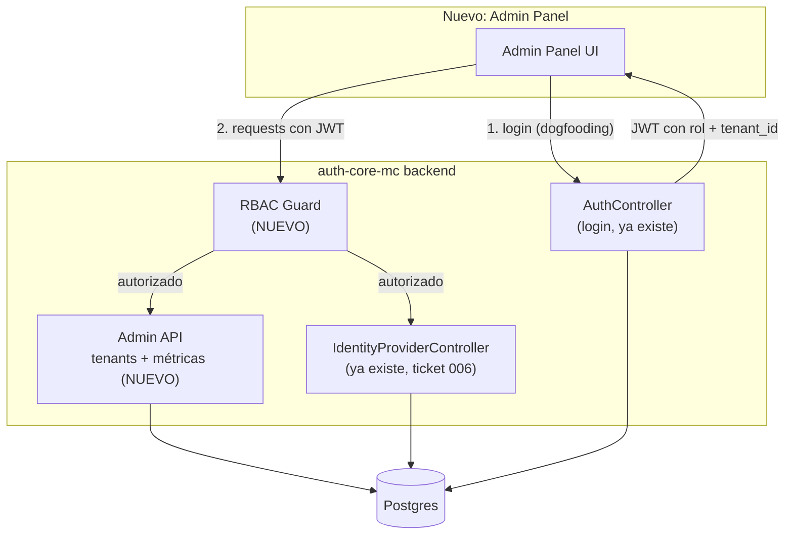
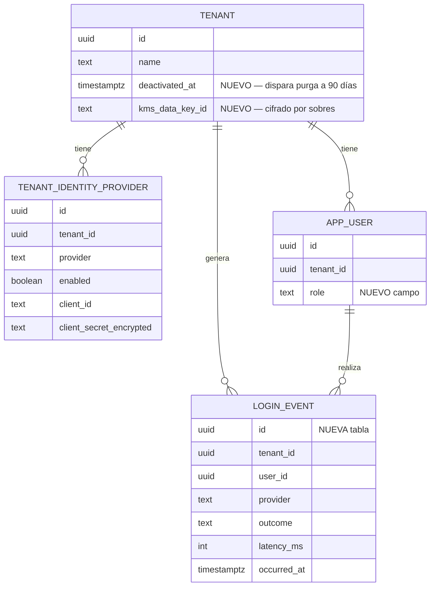
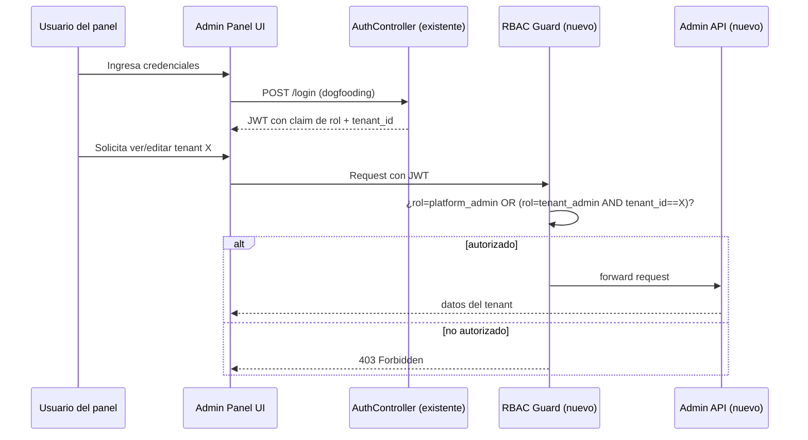

# Definición: Panel de administración de clientes

## Resumen ejecutivo

Un panel de administración donde se dan de alta clientes (tenants), se configuran sus proveedores de login social y las credenciales de esos proveedores, y se consultan métricas de uso — con dos niveles de acceso (administradores de la plataforma y administradores del propio cliente). Gran parte del backend de "proveedores y secretos" **ya existe** (ticket 006); lo nuevo real es la gestión de tenants, el control de acceso por rol, el registro de eventos para métricas, y la interfaz del panel en sí.

## Objetivo de negocio

Permitir operar auth-core-mc como plataforma multi-cliente sin intervención manual directa en base de datos: alta de clientes nuevos, autoservicio de configuración de sus proveedores de login, y visibilidad de uso — reduciendo el trabajo operativo del equipo y dándole autonomía a cada cliente sobre su propia configuración.

## Alcance

### Incluye
- Alta, edición y baja (desactivación) de clientes (tenants).
- Configuración de proveedores de login social (Google, Facebook) por cliente, reutilizando el servicio ya existente — incluye alta/edición/baja de sus credenciales.
- Control de acceso por rol: administradores de plataforma (ven/editan todo) y administradores de cliente (ven/editan solo su propio tenant).
- Métricas por cliente: volumen de logins éxito/fallo, desglose por proveedor, usuarios activos/registrados, tasa de error y latencia.
- Autenticación del panel usando el propio auth-core-mc (dogfooding).

### No incluye (fuera de alcance de esta versión)
- Apple como proveedor de login (ya rechazado explícitamente desde ticket 006 — `UnsupportedProviderException`, no se revisita aquí).
- El flujo de redirect/callback de login social en sí para usuarios finales (eso es ticket 007/009, ya entregado por separado) — este panel solo administra la *configuración*, no ejecuta el login de los usuarios finales de cada cliente.
- Facturación/planes comerciales por cliente.
- Mecanismo de "break glass" para cuando auth-core-mc esté caído (queda como riesgo documentado, no resuelto aquí).

## Historias de Usuario

### HU-1: Alta de un cliente nuevo
Como administrador de la plataforma,
quiero dar de alta un nuevo cliente (tenant),
para empezar a ofrecerle el servicio de autenticación.

Criterios de aceptación:
- Dado que soy platform_admin autenticado, cuando creo un tenant con nombre/slug único, entonces se crea correctamente y aparece en el panel.
- Dado un slug ya existente, cuando intento crear un tenant con ese slug, entonces recibo un error de conflicto claro (no un error genérico).

### HU-2: Configurar proveedores de login de un cliente
Como administrador (de plataforma o del propio tenant),
quiero configurar/activar/desactivar los proveedores de login social de mi cliente con sus propias credenciales,
para que los usuarios de ese cliente puedan iniciar sesión con esos métodos.

Criterios de aceptación:
- Dado que tengo acceso a un tenant, cuando ingreso client_id/client_secret de Google o Facebook y guardo, entonces el secreto se cifra y nunca se vuelve a mostrar en claro (comportamiento ya existente de `TenantIdentityProviderService`/`SecretEncryptor`, ticket 006 — el panel solo necesita exponerlo, no reimplementarlo).
- Dado un secreto ya guardado, cuando quiero cambiarlo, entonces debo ingresar uno nuevo completo — el panel nunca precarga ni permite editar parcialmente el valor enmascarado.
- Dado Apple como proveedor, cuando intento configurarlo, entonces el sistema lo rechaza explícitamente (ya existente).

### HU-3: Acceso al panel con roles diferenciados (RBAC)
Como usuario del panel,
quiero iniciar sesión con mis credenciales de auth-core-mc y ver solo lo que me corresponde según mi rol,
para que la información de otros clientes esté protegida.

Criterios de aceptación:
- Dado un usuario platform_admin, cuando inicia sesión, entonces ve y puede administrar todos los tenants.
- Dado un usuario tenant_admin, cuando inicia sesión, entonces ve y puede administrar únicamente su propio tenant.
- Dado un usuario tenant_admin, cuando intenta acceder (por URL directa o llamada API) a un tenant que no es el suyo, entonces recibe 403, no una fuga de datos ni un error genérico.

### HU-4: Ver métricas de uso por cliente
Como administrador (de plataforma o del tenant),
quiero ver métricas de uso de un cliente,
para entender la salud y adopción del servicio de ese cliente.

Criterios de aceptación:
- Dado un tenant con actividad, cuando abro su vista de métricas, entonces veo volumen de logins por resultado (éxito/fallo) y por proveedor, en un rango de fechas seleccionable.
- Dado un tenant con actividad, cuando abro sus métricas, entonces veo usuarios activos/registrados y tasa de error/latencia promedio.
- Dado un tenant sin actividad reciente, cuando abro sus métricas, entonces veo un estado vacío claro, no un error o una pantalla en blanco.

### HU-5: Edición y baja de un cliente existente
Como administrador de la plataforma,
quiero editar o desactivar un cliente existente,
para corregir datos o dar de baja un cliente que ya no usa el servicio.

Criterios de aceptación:
- Dado un tenant existente, cuando lo edito, entonces los cambios quedan reflejados de inmediato.
- Dado un tenant que se desactiva, cuando se desactiva, entonces sus usuarios no pueden iniciar sesiones nuevas, se registra `deactivated_at`, y sus datos no se borran físicamente de inmediato (soft delete) — se purgan automáticamente 90 días después si no se reactiva.

## Diseño técnico

**Se reutiliza sin cambios** (verificado contra el código real antes de escribir esta sección, no asumido):
- `TenantIdentityProviderService` (`list`/`configure`/`disable`) y `SecretEncryptor` (ticket 005/006) — ya cifran y almacenan `client_secret` por tenant, y ya nunca lo exponen en claro. Cumple exactamente el requisito de manejo de secretos elegido.
- Endpoints `GET/PUT/DELETE /api/v1/identity-providers/*` — el panel los consume, no los reimplementa.
- Tabla `tenant_identity_provider` (ya existe, columnas `provider`, `enabled`, `client_id`, `client_secret_encrypted`).

**Nuevo:**
- **RBAC**: agregar noción de rol — decisión pendiente entre columna `role` en `app_user` vs. tabla `user_role` aparte (importa si un usuario puede tener roles distintos en distintos tenants; con el modelo actual de `app_user` ya escoped a un tenant, probablemente basta una columna). A confirmar con `architect` antes de implementar.
- **Endpoints de administración de tenants**: `POST/GET/PUT/DELETE /api/v1/admin/tenants` — no existen hoy, hay que crearlos desde cero.
- **Registro de eventos de login**: nueva tabla `login_event` (tenant_id, user_id nullable, provider, outcome SUCCESS/FAILURE, latency_ms, occurred_at) — se inserta en cada intento de autenticación real. Requiere instrumentar el flujo de auth existente, no solo crear la tabla.
- **Endpoints de métricas**: `GET /api/v1/admin/tenants/{id}/metrics?from=&to=` — agregaciones sobre `login_event`.
- **Frontend del panel**: nueva sección de UI (consistente con el theming/stack ya establecido en ticket 009) — vistas de gestión de tenants, configuración de proveedores (consume API existente), y dashboard de métricas.
- **Auth del panel**: dogfooding sobre el login ya existente de auth-core-mc, más verificación de rol en cada request (guard/interceptor nuevo).
- **Cifrado por sobres**: cada tenant obtiene una data-key generada al crearse (`kms_data_key_id`), cifrada por una master key en KMS; `SecretEncryptor` se extiende para resolver la data-key correcta por tenant en vez de usar la clave estática única actual. Incluye migración de los 2 secretos ya cifrados (Google/Meta) al nuevo esquema.
- **Job de purga**: tarea programada que, para cada `TENANT` con `deactivated_at` hace más de 90 días, elimina físicamente sus datos (usuarios, tokens, credenciales de proveedores).
- **Endpoint de break-glass**: ruta de emergencia independiente de `AuthController`/OAuth2, gateada por secreto pre-compartido rotable, fuertemente auditada (cada uso queda registrado) — para acceso administrativo cuando el flujo normal de auth esté degradado.

## Diagramas

### Arquitectura — qué se reutiliza vs. qué es nuevo

### Modelo de datos — entidades existentes vs. nuevas

### Secuencia — acceso al panel con control de rol

## Riesgos y decisiones (resueltos con el Product Owner, 2026-08-21)

- **Gestión de la clave de cifrado — RESUELTO: se sube a cifrado por sobres.** Investigado: `SecretEncryptor` hoy usa una sola clave AES-256-GCM estática (`APP_SECRET_ENCRYPTION_KEY`), la misma para todos los secretos. Decisión: antes de guardar secretos de clientes externos, cada tenant tendrá su propia data-key, cifrada a su vez por una master key en KMS — si una data-key se filtra, el blast radius es un solo tenant, no todos. Proveedor de KMS específico (AWS/GCP/Vault) queda como detalle técnico a resolver en su propio ticket, según dónde se despliegue en producción.
- **Dependencia circular (dogfooding) — RESUELTO: sí se construye un mecanismo de break-glass.** Dirección técnica propuesta: un endpoint de emergencia independiente del flujo normal de login (no pasa por `AuthController`/OAuth2), gateado por un secreto pre-compartido rotable y fuertemente auditado — para que siga funcionando aunque el flujo de auth normal tenga un incidente. Detalle final (segundo factor, allowlist de IP, etc.) se resuelve en su propio ticket.
- **Retención de datos — RESUELTO: purga automática a 90 días.** Un tenant desactivado se purga físicamente 90 días después de la desactivación (soft delete + job de purga programado). Requiere un campo `deactivated_at` en `TENANT` para calcular la fecha de purga.
- **Volumen esperado de `login_event` — RESUELTO: bajo/moderado al inicio.** No se particiona la tabla en v1 — tabla simple, se revisita si el volumen crece.
- **Modelo exacto de RBAC** (columna vs. tabla de roles): decisión técnica que no bloquea el resto del alcance — columna `role` en `app_user` (ya está 1:1 scoped a un tenant, no hace falta tabla aparte), se confirma en el ticket de RBAC específico.

## Impacto estimado (tickets tentativos)

1. RBAC — roles `platform_admin`/`tenant_admin` y scoping de endpoints existentes y nuevos.
2. Alta/edición/baja de tenants (API + UI), incluyendo `deactivated_at` y el job de purga automática a 90 días.
3. UI de configuración de proveedores de login (consume API ya existente de ticket 006 — no requiere tocar el backend de eso).
4. Registro de eventos de login (`login_event`, sin particionamiento en v1) — instrumentación del flujo de auth existente.
5. Endpoints + UI de métricas.
6. Auth del panel (dogfooding) + guard de rol.
7. **Cifrado por sobres**: data-key por tenant + integración con KMS, migración de los 2 secretos existentes al nuevo esquema.
8. **Mecanismo de break-glass**: endpoint de emergencia independiente del flujo normal de login.
