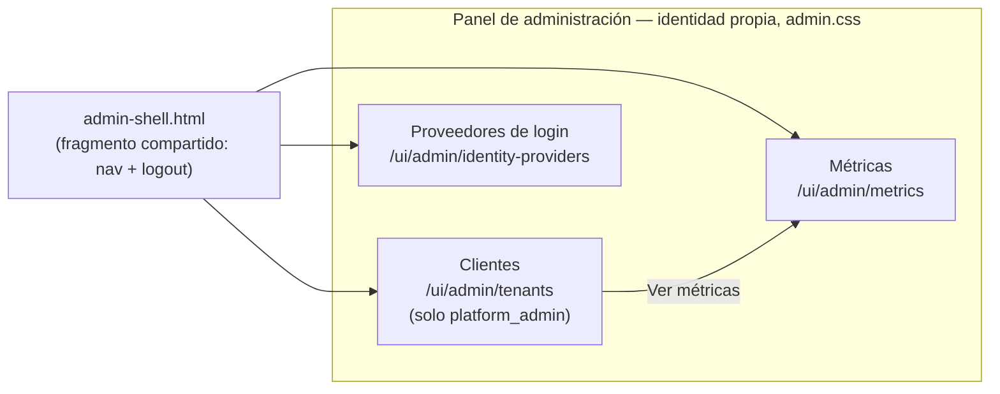
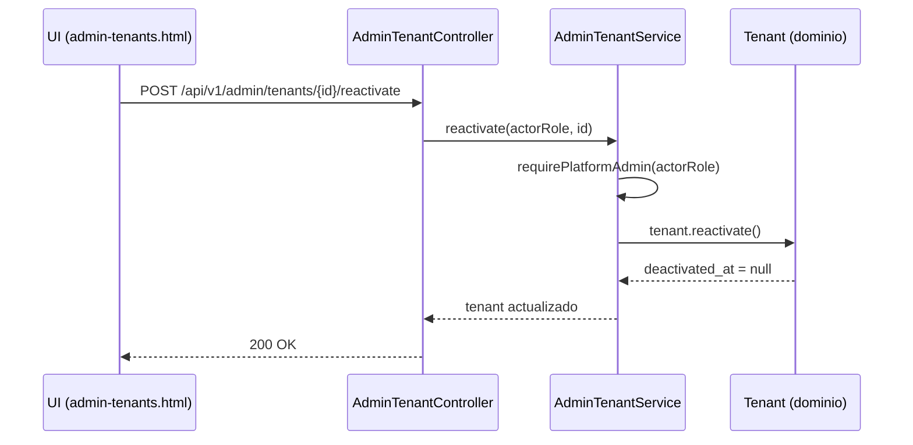

# Definición: Rediseño de la UI completa (panel de administración + páginas de usuario final)

## Resumen ejecutivo
Auth-core-mc tiene hoy 10 páginas server-rendered (Thymeleaf): 7 de usuario final (registro, login, cuenta, reset/verificación de correo) y 3 del panel de administración (tenants, métricas, proveedores de login), todas construidas sobre el mismo sistema visual mínimo del ticket 009/010 — un card centrado de 520px, sin layout de panel, sin navegación compartida entre las pantallas admin. Este cambio introduce **dos sistemas de diseño separados y coherentes**: uno themable por tenant (páginas de usuario final, se mantiene el modelo `--primary-color`) y uno con identidad propia fija, tono utilitario tipo dashboard (panel de administración, con navegación real entre sus 3+1 pantallas). De paso, cierra 4 huecos funcionales reales del panel: alta y edición de tenant desde la UI, confirmación antes de desactivar, y reactivación de un tenant desactivado (el dominio ya soporta `reactivate()`, ningún endpoint lo expone todavía).

## Objetivo de negocio
El panel de administración es la herramienta operativa diaria del equipo (platform_admin/tenant_admin) para gestionar clientes de auth-core-mc. Su estado actual (islas de página sin navegación, sin identidad visual propia, sin operaciones básicas como reactivar) genera fricción real de uso y no transmite la seriedad de un producto de identidad/seguridad. Las páginas de usuario final, aunque funcionales, tienen el mismo nivel mínimo de pulido — siendo la primera impresión de cada tenant con SUS propios usuarios finales, vale la pena el mismo nivel de cuidado.

## Alcance

### Incluye
- **Sistema visual del panel de administración**: identidad propia (paleta, tipografía, espaciado) independiente del `--primary-color` de cualquier tenant — el panel no se tematiza por cliente, es una herramienta interna.
- **Layout de panel compartido** entre las 3 pantallas admin existentes (`/ui/admin/tenants`, `/ui/admin/metrics`, `/ui/admin/identity-providers`): navegación persistente, saber en qué sección se está, cerrar sesión.
- **Rediseño visual/estructural de las 7 páginas de usuario final** (`/ui/register`, `/ui/login`, `/ui/cuenta`, `/ui/password-reset/request`, `/ui/password-reset/confirm`, `/ui/verify-email/confirm`, `/ui/change-email/confirm`) — mejora de tipografía, jerarquía, espaciado, estados de carga/vacío. **El modelo de theming por tenant (`--primary-color`) se mantiene intacto** — es su propósito, no un problema a resolver.
- **4 capacidades nuevas en el panel admin**:
  - Alta de tenant desde la UI (formulario real; hoy solo vía API).
  - Edición de tenant desde la UI (el backend ya soporta `PUT`, ninguna pantalla lo usa).
  - Confirmación explícita antes de desactivar un tenant (acción de alto impacto, hoy un clic desactiva sin preguntar).
  - Reactivación de un tenant desactivado — **requiere backend nuevo**: `Tenant.reactivate()` ya existe en el dominio (ticket 013) pero ningún endpoint lo expone.

### No incluye
- Selector de tenant en "proveedores de login" (decisión ya tomada explícitamente en el ticket 019 — esa página sigue solo-tenant-propio).
- Un listado/paginación para el caso de muchos tenants (sigue siendo "volumen bajo", decisión ya establecida del proyecto).
- Cambiar el stack técnico: sigue siendo Thymeleaf server-rendered, sin SPA ni toolchain npm (decisión ya tomada en el ticket 009) — el rediseño es CSS/HTML/JS vanilla, igual que el resto del proyecto.
- Dark mode (no se pidió; puede evaluarse en un ticket futuro sobre el mismo sistema de tokens que este cambio deja instalado).

## Historias de Usuario

### HU-1: Identidad visual propia del panel de administración
Como platform_admin o tenant_admin, quiero que el panel de administración se vea como una herramienta operativa seria y consistente, para operar con confianza y sin la sensación de estar en una página a medio construir.

Criterios de aceptación:
- Dado que visito cualquier página `/ui/admin/**`, cuando la cargo, entonces veo una paleta, tipografía y espaciado propios del panel — no el `--primary-color` de ningún tenant.
- Dado que cambio entre distintas páginas del panel, cuando navego, entonces el sistema visual es idéntico en las 3 (+1 layout compartido) — nada se siente "pegado" de otro sistema.

### HU-2: Navegación real entre las secciones del panel
Como platform_admin o tenant_admin, quiero moverme entre "Clientes", "Métricas" y "Proveedores de login" sin escribir URLs a mano, para operar el panel como una herramienta real, no como páginas sueltas.

Criterios de aceptación:
- Dado que estoy en cualquier página del panel, cuando miro la navegación, entonces veo las secciones disponibles para mi rol y cuál está activa.
- Dado que soy `tenant_admin`, cuando veo la navegación, entonces **no** aparece la sección "Clientes" (solo accesible para platform_admin — ver ticket 019).
- Dado que quiero salir del panel, cuando uso la opción de cerrar sesión, entonces mi sesión local se limpia y vuelvo al login.

### HU-3: Rediseño de las páginas de usuario final
Como usuario final de un tenant, quiero que las páginas de registro/login/cuenta se vean cuidadas y coherentes con la marca de mi proveedor, para confiar en el producto donde estoy creando mi cuenta.

Criterios de aceptación:
- Dado que visito cualquier página de usuario final, cuando la cargo, entonces sigue reflejando el `--primary-color` configurado por el tenant (sin regresión del theming existente).
- Dado que comparo el antes/después, cuando reviso tipografía/espaciado/estados de carga y vacío, entonces hay una mejora real y consistente en las 7 páginas, no solo en algunas.

### HU-4: Alta de tenant desde la UI
Como platform_admin, quiero dar de alta un cliente nuevo sin usar curl/Postman, para operar el panel sin depender de la terminal.

Criterios de aceptación:
- Dado que soy platform_admin en "Clientes", cuando lleno el formulario de alta (nombre, app, color, TTLs) y lo envío, entonces el tenant se crea de verdad (mismo `POST /api/v1/admin/tenants` ya existente) y aparece en la lista.
- Dado que el nombre ya existe, cuando intento crear, entonces veo el error 409 real de forma clara, no un fallo silencioso.

### HU-5: Edición de tenant desde la UI
Como platform_admin (cualquier tenant) o tenant_admin (el suyo), quiero editar los datos de un cliente sin usar la API directamente, para poder ajustar configuración operativa desde el panel.

Criterios de aceptación:
- Dado que tengo acceso a un tenant, cuando edito appName/color/TTLs y guardo, entonces se refleja de inmediato (mismo `PUT` ya existente).
- Dado que intento editar un tenant que no es el mío (tenant_admin), cuando lo intento, entonces veo un 403 real, no una pantalla accesible que falle silenciosamente.

### HU-6: Confirmación antes de desactivar un tenant
Como platform_admin, quiero que desactivar un cliente pida confirmación explícita, para no bloquear accidentalmente el login de un cliente real con un clic.

Criterios de aceptación:
- Dado que presiono "Desactivar" sobre un tenant, cuando se me pide confirmar, entonces la acción solo ocurre tras una segunda confirmación explícita (no un `confirm()` nativo del navegador — ver Riesgos).
- Dado que cancelo la confirmación, cuando lo hago, entonces el tenant permanece activo, sin llamada al backend.

### HU-7: Reactivar un tenant desactivado
Como platform_admin, quiero poder reactivar un cliente que desactivé por error (o cuya baja ya no aplica), para no depender de esperar la purga de 90 días o de una intervención manual en base de datos.

Criterios de aceptación:
- Dado que un tenant está desactivado y no ha sido purgado, cuando presiono "Reactivar" y confirmo, entonces vuelve a aceptar logins/registro de inmediato (mismo choke-point `ClientContextResolver` del ticket 013, ahora viendo `deactivated_at = null`).
- Dado que soy tenant_admin, cuando intento reactivar, entonces recibo 403 — reactivar es tan sensible como desactivar, mismo nivel de permiso (`platform_admin`-only).

## Diseño técnico

**Dos sistemas de diseño, no uno.** Confirmado explícitamente por el Product Owner: el panel admin es una herramienta operativa interna (la usan platform_admin/tenant_admin), las páginas de usuario final son la cara de cada tenant hacia SUS clientes. Forzarlos al mismo sistema (como hoy) es lo que produce la sensación de "todo es una página de login". Separar los dos sistemas es la decisión de mayor apalancamiento de este cambio — mismo patrón que productos reales de identidad (p. ej. panel de operación vs. pantalla de login universal).

- **`static/css/admin.css` (nuevo, separado de `app.css`)**: tokens propios (paleta neutra con un acento fijo, tipografía, espaciado) para las 4 páginas del panel (`admin-tenants`, `admin-metrics`, `admin-identity-providers` + el nuevo layout compartido). Nunca lee `--primary-color`. `app.css` se mantiene intacto y sigue siendo exclusivo de las páginas de usuario final — cero riesgo de regresión ahí por este cambio.
  - **Paleta confirmada — "Slate + Índigo"** (Opción A de las 3 propuestas revisadas con el Product Owner): fondo `#f8f9fb`, superficie `#ffffff`, borde `#e4e7ec`, texto `#101322`, texto secundario `#667085`, acento `#4f46e5` (hover `#4338ca`), acento suave `#eeedfd` (fondos de nav activo/badges). Tipografía: misma pila del sistema ya usada en `app.css` (sin fuente web externa, mismo criterio de privacidad/disponibilidad ya establecido en el ticket 010) — el acento y los neutros son lo que distingue al panel, no la tipografía.
- **Fragmento Thymeleaf compartido** (`templates/fragments/admin-shell.html`, usando `th:fragment`) con el header/nav del panel — cada página admin lo incluye vía `th:replace`/`th:insert` en vez de repetir el `<header>` a mano en cada archivo (hoy cada página admin ya duplica el mismo `<header class="app-header">`).
- **`api.js` gana dos funciones nuevas, aditivas**: `logout()` (limpia `sessionStorage`, redirige a `/ui/login`) y `currentRole()` (decodifica `role` del JWT, mismo patrón ya usado por `currentTenantId()`) — el shell del panel las usa para saber qué mostrar en la navegación (ocultar "Clientes" si no es platform_admin) sin round-trip al backend.
- **Backend nuevo, mínimo**: `POST /api/v1/admin/tenants/{id}/reactivate` en el ya-existente `AdminTenantController`, delegando a `AdminTenantService.reactivate(actorRole, targetTenantId)` — mismo patrón exacto que `deactivate` (platform_admin-only, usa `Tenant.reactivate()` ya existente en el dominio desde el ticket 013). Sin migración: `deactivated_at` ya es nullable.
- **Confirmación de acciones destructivas**: un diálogo propio en HTML/CSS (no el `confirm()` nativo del navegador) — consistente con que el resto de la UI ya evita el comportamiento nativo del navegador donde importa (ver ticket 010, remoción de `httpBasic()` por el popup nativo que generaba). Un `<dialog>` HTML nativo (soportado sin librería) o un modal simple con overlay — decisión de implementación, no de producto.
- **Sin cambios al modelo de autorización**: alta/edición/desactivación/reactivación desde la UI llaman exactamente a los endpoints ya existentes (o al nuevo `/reactivate`, mismo nivel de permiso que `/deactivate`) — este cambio es de superficie (UI) y de una operación de dominio ya soportada, no reabre ninguna decisión de seguridad ya tomada.

## Diagramas

El layout compartido (`admin-shell.html`) envuelve las 3 páginas admin — la navegación entre ellas pasa a ser un componente, no una URL que hay que conocer de memoria. "Clientes" solo aparece en el nav si el rol es platform_admin (mismo dato que ya decide el 403 del backend, ahora también usado para ocultar la opción).

Único flujo con backend genuinamente nuevo de este cambio — mismo patrón que `deactivate` (ticket 013), reutilizando el método de dominio ya existente.

## Decisiones resueltas con el Product Owner
Las 3 preguntas abiertas de la primera versión de este documento ya se resolvieron explícitamente antes del VoBo final:
- **Confirmación al reactivar**: sí, mismo componente de diálogo que desactivar (no dos patrones distintos para el mismo tipo de decisión).
- **Orden de implementación**: panel admin primero (ahí vive toda la funcionalidad nueva); páginas de usuario final al final, sin dependencia técnica del panel.
- **Paleta del panel**: "Slate + Índigo" (ver valores exactos en Diseño técnico) — elegida entre 3 propuestas mostradas en contexto real (nav + tabla + botón), no solo como swatches.

## Impacto estimado
Lista tentativa de tickets (se refina al usar `nuevo-ticket` tras el VoBo), en el orden de implementación acordado:
1. **Sistema visual + layout compartido del panel admin** (`admin.css` con la paleta Slate+Índigo, `admin-shell.html`, `api.js` con `logout()`/`currentRole()`, migrar las 3 páginas admin existentes al nuevo shell/estilos).
2. **Alta y edición de tenant desde la UI** (formularios reales en `/ui/admin/tenants`, sin backend nuevo).
3. **Reactivar tenant + confirmación antes de desactivar** (backend nuevo `POST .../reactivate`, más el diálogo de confirmación compartido por ambas acciones — van juntos por compartir el mismo componente).
4. **Rediseño de las 7 páginas de usuario final** (mejora de `app.css`, manteniendo el theming por tenant intacto).
